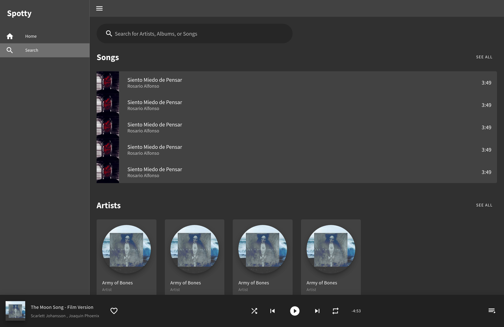
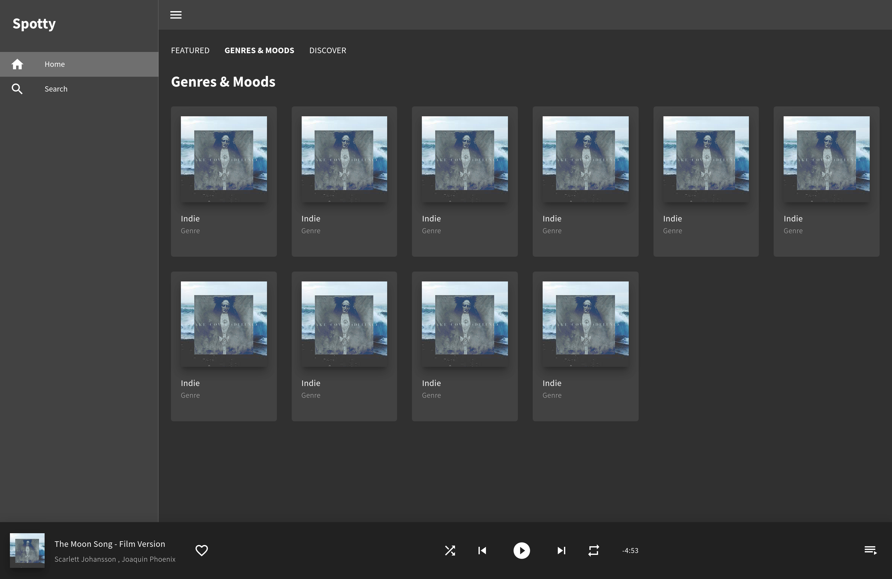

# [spotty](https://krthr.github.io/spotty/)

> Spotify web clone build with Vue.js and Vuetify

## DEMO: https://krthr.github.io/spotty/

## Screenshoots

### Search page



### Genres page



## Pages

- [x] Album
- [ ] Artist
- [x] Discover
- [x] Feauted
- [x] Genres & Moods
- [x] Login \*
- [x] Play Queue
- [ ] Sign Up

## Project setup

```
npm install
```

### Compiles and hot-reloads for development

```
npm run serve
```

### Compiles and minifies for production

```
npm run build
```

### Lints and fixes files

```
npm run lint
```

### Customize configuration

See [Configuration Reference](https://cli.vuejs.org/config/).
